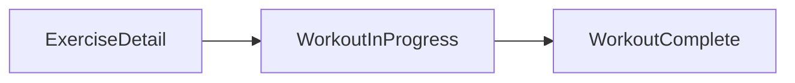

# Workout flow — three screens (step-by-step)

## Naming (confirmed)

- **Reusable component:** `ExerciseDetail` (not `ExerciseScreenTemplate`).
- **Suggested file:** [`frontend/src/components/ExerciseDetail.tsx`](frontend/src/components/ExerciseDetail.tsx) exporting the presentational component + props types.

## Three-screen roadmap



| Step | Screen | Role |
|------|--------|------|
| 1 | **Exercise Detail** | Library / pre-set: video, name, tag, sets/reps/rest, optional toggle, structured instructions (SETUP / EXECUTION / PROGRESSION), sticky Start + Mark complete. Data-driven via props only. |
| 2 | **Workout In Progress** | Active session UI (evolve from current [`frontend/app/generate-workout.tsx`](frontend/app/generate-workout.tsx) `Step7` or replace with dedicated screen). |
| 3 | **Workout Complete** | Session end (evolve from current `Step8` or dedicated screen). |

**Scope for this iteration (Step 1 only when executing):** implement **Exercise Detail** + a stack route that renders it with mock/sample props. Do **not** fully replace `Step7`/`Step8` until Step 2–3 plans are executed.

## Exercise Detail — props contract

```ts
export type ExerciseInstructions = {
  setup: string[];
  execution: string[];
  progression: string[];
};

export type ExerciseDetailProps = {
  exerciseName: string;
  videoUrl: string;
  equipmentTag: string;
  sets: string | number;
  reps: string | number;
  rest: string | number;
  instructions: ExerciseInstructions;
  stepCurrent: number;
  stepTotal: number;
  optionalToggle?: {
    label: string;
    description?: string;
    value: boolean;
    onValueChange: (next: boolean) => void;
  };
  onBack: () => void;
  onStart: () => void;
  onMarkComplete: () => void;
};
```

## Exercise Detail — layout (unchanged from prior plan, renamed only)

- Header: back + step label + title.
- Video block: 16:9-style container, play overlay; **video implementation:** add `expo-av` for real `videoUrl` playback (recommended) unless MVP is poster-only.
- Title, equipment tag, sets/reps/rest row, optional toggle.
- Instructions: three sections with uppercase labels + bullets; skip empty arrays.
- Bottom sticky bar: Mark complete + Start; safe-area padding.

## Route (Step 1)

- New stack screen e.g. [`frontend/app/exercise-detail.tsx`](frontend/app/exercise-detail.tsx) rendering `<ExerciseDetail {...sample} />`.
- Register in [`frontend/app/_layout.tsx`](frontend/app/_layout.tsx).

## Later steps (documented, not executed in Step 1)

- **Workout In Progress:** align UX with product (controls, progress, exercise index); map from `GenerateWorkoutScreen` state or new session store.
- **Workout Complete:** align with completion summary; reuse miles/stats patterns from existing `Step8` where possible.
- **Flow integration:** `router.push` chain ExerciseDetail → In Progress → Complete; eventually remove duplicate logic from monolithic `generate-workout.tsx` steps.

## Out of scope for Step 1

- Changing tab layouts or unrelated screens.
- Animations beyond minimal press feedback.
